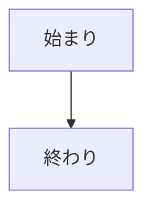
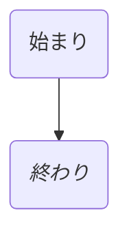
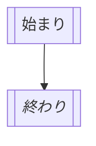

# MermaidでFlowchart

### 単純なFlowchart


行頭にフローチャートを表す```flowchart```に続き，横書きなら```LR```を，縦書きなら```TD```を付ける．
```id1```などの部分は識別子なので，予約語以外なら何でも構わない模様．
また，```["始まり"]```の部分は表示内容で，ASCII textであれば（Unicode Text以外であれば）ダブルクォーテーションは不要である．
また，ダブルクォーテーション内にバッククォートを付けるとMarkdownで記述できる．ついでに書くと改行もできる．

### 枠の形状について

枠の形状としていくつか用意されている．
形状 | 例
-|-
矩形 | ["始まり"]
角丸四角形 | ("始まり")
二重矩形 | [["始まり"]]
記憶装置 | [("始まり")]
円 | (("始まり"))
非対称形 | >"始まり"]
ひし形 | {"始まり"}
六角形 | {{"始まり"}}
平行四辺形 | [/"始まり"/]
逆平行四辺形 | [\"始まり"\]
台形 | [/"始まり"\]
逆台形 | [\"始まり/]
二重円 | ((("始まり")))


ここで，```["始まり"]```を```("始まり")```にすると，フローチャート内の形状が矩形から角丸形に変わる．


同様に```[["始まり"]]```のようにすると二重線に変わる．



