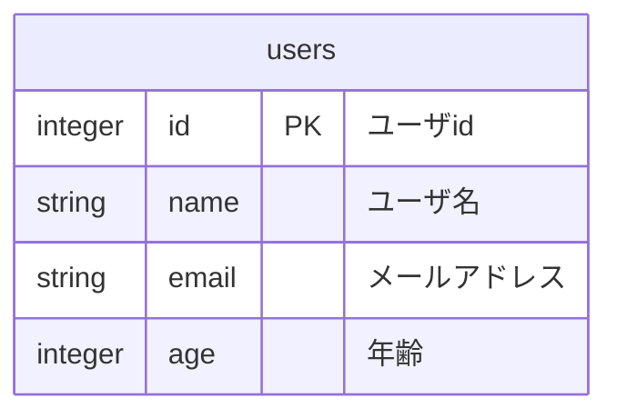
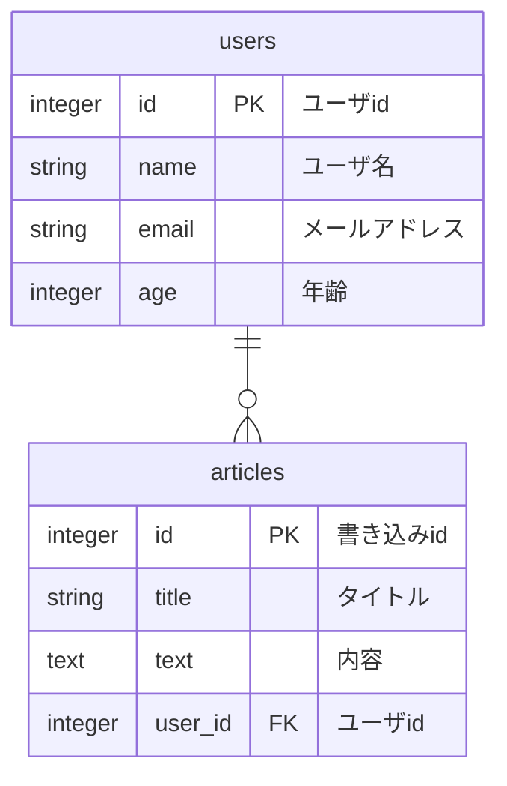
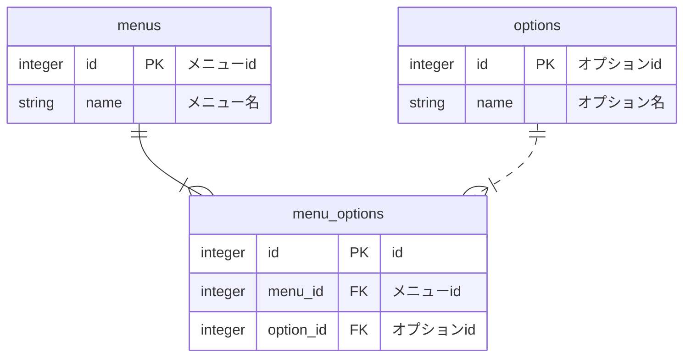
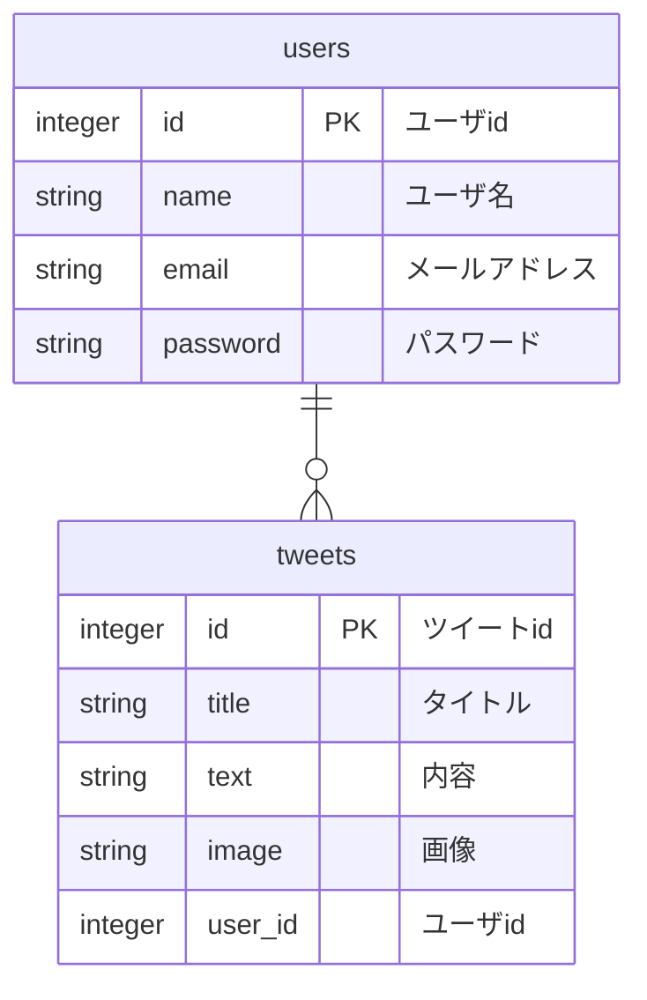
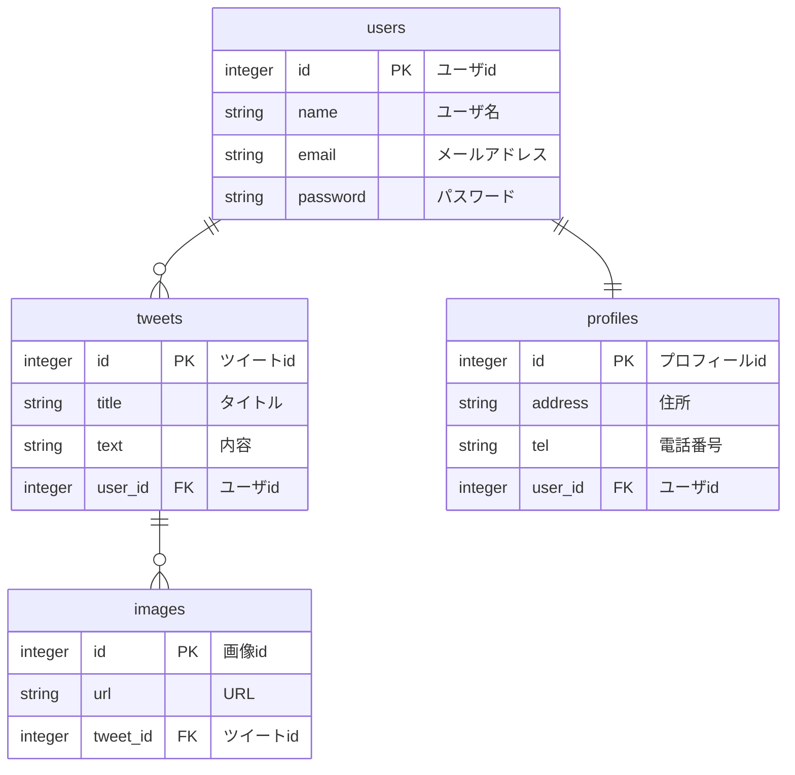

# MermaidでER図

### 単純な表

```mermaid
erDiagram

users {
  integer id PK "ユーザid"
  string name "ユーザ名"
  string email "メールアドレス"
  integer age "年齢"
}
```

### リレーション

```mermaid
erDiagram
users ||--o{ articles: ""

users {
  integer id PK "ユーザid"
  string name "ユーザ名"
  string email "メールアドレス"
  integer age "年齢"
}

articles {
  integer id PK "書き込みid"
  string title "タイトル"
  text text "内容"
  integer user_id FK "ユーザid"
}
```

### 中間テーブル

```mermaid
erDiagram
menus ||--|{ menu_options: ""
options ||..|{ menu_options: ""
menus {
  integer id PK "メニューid"
  string name "メニュー名"
}

options {
  integer id PK "オプションid"
  string name "オプション名"
}

menu_options {
  integer id PK "id"
  integer menu_id FK "メニューid"
  integer option_id FK "オプションid"
}
```

### 1対多

```mermaid
erDiagram
users ||--o{ tweets: ""

users {
  integer id PK "ユーザid"
  string name "ユーザ名"
  string email "メールアドレス"
  string password "パスワード"
}

tweets {
  integer id PK "ツイートid"
  string title "タイトル"
  string text "内容"
  string image "画像"
  integer user_id "ユーザid"
}
```

### 1対1

```mermaid
erDiagram
users ||--o{ tweets: ""
users ||--|| profiles: ""
tweets ||--o{ images: ""

users {
  integer id PK "ユーザid"
  string name "ユーザ名"
  string email "メールアドレス"
  string password "パスワード"
}

profiles {
  integer id PK "プロフィールid"
  string address "住所"
  string tel "電話番号"
  integer user_id FK "ユーザid"
}

tweets {
  integer id PK "ツイートid"
  string title "タイトル"
  string text "内容"
  integer user_id FK "ユーザid"
}

images {
  integer id PK "画像id"
  string url "URL"
  integer tweet_id FK "ツイートid"
}

```
